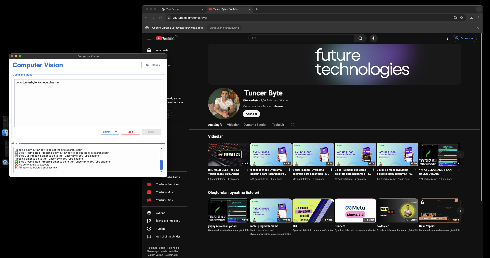
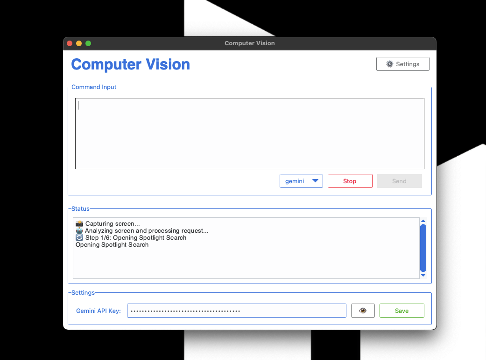

# Computer Vision 🤖

An AI-powered computer vision control assistant that uses Google's Gemini Pro Vision model to understand and control your computer through natural language commands and visual context.

## 🎥 Demo & Screenshots

### Browser Control Demo
[Watch the demo video](https://github.com/atesbey-design/computer-vision/issues/1)

*Demo video showing the AI assistant controlling the browser using natural language commands and visual feedback*

### YouTube Navigation

*AI navigating to YouTube using keyboard shortcuts and visual feedback*

### Visual Feedback System

*Active area highlighting with blue border showing the current focus area*

### Key Features Demonstrated:
- 🎯 Natural language command processing
- ⌨️ Intelligent keyboard shortcut usage
- 🔷 Visual feedback with blue border highlighting
- 🖱️ Precise mouse control when needed
- 📊 Real-time status updates

### How It Works:
1. **Command Input**: Type natural language commands like "Open Chrome and go to YouTube"
2. **Visual Analysis**: AI analyzes the screen to understand the current state
3. **Smart Execution**: 
   - First attempts to use keyboard shortcuts
   - Falls back to mouse control if needed
4. **Visual Feedback**: 
   - Blue border highlights active areas
   - Status updates show progress
   - Real-time command execution feedback

## 🌟 Features

- 🎯 **Intelligent Computer Control**: Control your computer using natural language commands and visual understanding
- 🖼️ **Visual Context Understanding**: Uses computer vision and screenshots to understand the current state of your computer
- ⌨️ **Smart Input Prioritization**: 
  - Prioritizes keyboard shortcuts for efficiency
  - Falls back to mouse control when necessary
- 🔷 **Visual Feedback**:
  - Blue border highlighting of active areas
  - Real-time status updates
  - Clear visual feedback for all actions
- 🔒 **Security**:
  - Secure API key management
  - Local screenshot processing
  - Permission-based access control

## 🚀 Getting Started

### Prerequisites

- Python 3.8 or higher
- MacOS (currently only supports MacOS)
- Google Gemini API key

### Installation

1. Clone the repository:
```bash
git clone https://github.com/atesbey-design/computer-vision.git
cd computer-vision
```

2. Create and activate a virtual environment:
```bash
python3 -m venv venv
source venv/bin/activate
```

3. Install dependencies:
```bash
pip install -r requirements.txt
```

4. Set up your Gemini API key:
   - Get an API key from [Google AI Studio](https://makersuite.google.com/app/apikey)
   - The app will prompt you to enter the key on first run

### Usage

1. Start the application:
```bash
python -m app.app
```

2. Grant necessary permissions:
   - The app will request accessibility permissions
   - This is required for keyboard and mouse control

3. Use natural language commands like:
   - "Open Chrome and go to google.com"
   - "Click the search button"
   - "Type 'hello world' in the text field"

## 🛠️ Technical Details

### Project Structure
```
computer-vision/
├── app/
│   ├── models/
│   │   ├── gemini.py      # Gemini model integration
│   │   └── ollama.py      # Ollama model integration
│   ├── utils/
│   │   ├── screen.py      # Screen capture and highlighting
│   │   └── settings.py    # Settings management
│   ├── app.py            # Main application
│   ├── core.py           # Core functionality
│   ├── interpreter.py    # Command interpretation
│   └── ui.py             # User interface
├── requirements.txt      # Dependencies
├── setup.py             # Package configuration
└── README.md            # Documentation
```

### Key Components

- **Gemini Model**: Analyzes screenshots and generates commands
- **Interpreter**: Executes commands using PyAutoGUI
- **Screen Manager**: Handles screen capture and visual feedback
- **Settings Manager**: Manages configuration and API keys

## 🔜 Future Enhancements

1. **Cross-Platform Support**
   - [ ] Windows support
   - [ ] Linux support

2. **Enhanced Visual Understanding**
   - [ ] Element recognition improvements
   - [ ] OCR integration
   - [ ] Better coordinate precision

3. **Advanced Features**
   - [ ] Custom shortcut definitions
   - [ ] Macro recording and playback
   - [ ] Task automation sequences
   - [ ] Voice command support

4. **UI Improvements**
   - [ ] Dark mode support
   - [ ] Customizable highlight colors
   - [ ] Better status visualization
   - [ ] Command history view

5. **Performance Optimizations**
   - [ ] Faster screen capture
   - [ ] Reduced API calls
   - [ ] Better caching

## 🤝 Contributing

Contributions are welcome! Please feel free to submit a Pull Request. For major changes, please open an issue first to discuss what you would like to change.

## 📝 License

This project is licensed under the MIT License - see the [LICENSE](LICENSE) file for details.

## 🙏 Acknowledgments

- Google's Gemini Pro Vision model
- PyAutoGUI for computer control
- The open-source community

## 📞 Support

If you encounter any issues or have questions:
1. Check the [Issues](https://github.com/atesbey-design/computer-vision/issues) page
2. Create a new issue if needed
3. Contact the maintainers directly

---

Made with ❤️ by Ates 